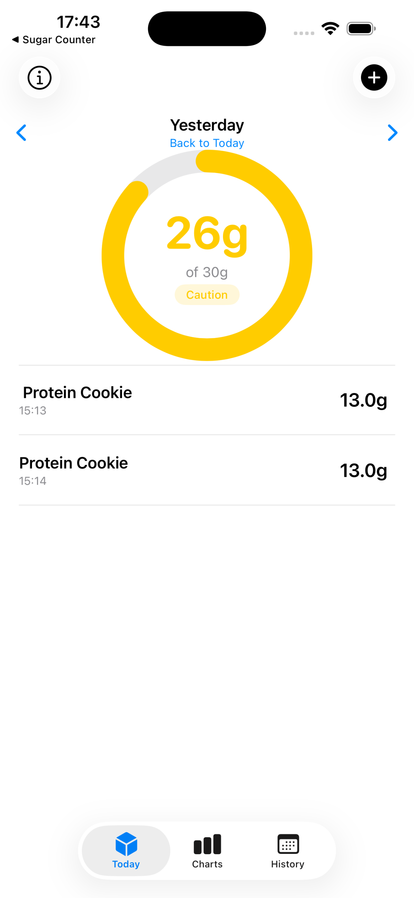
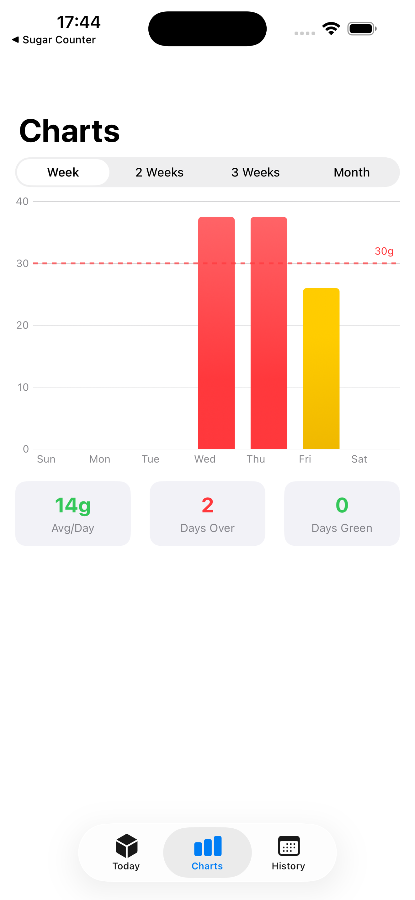
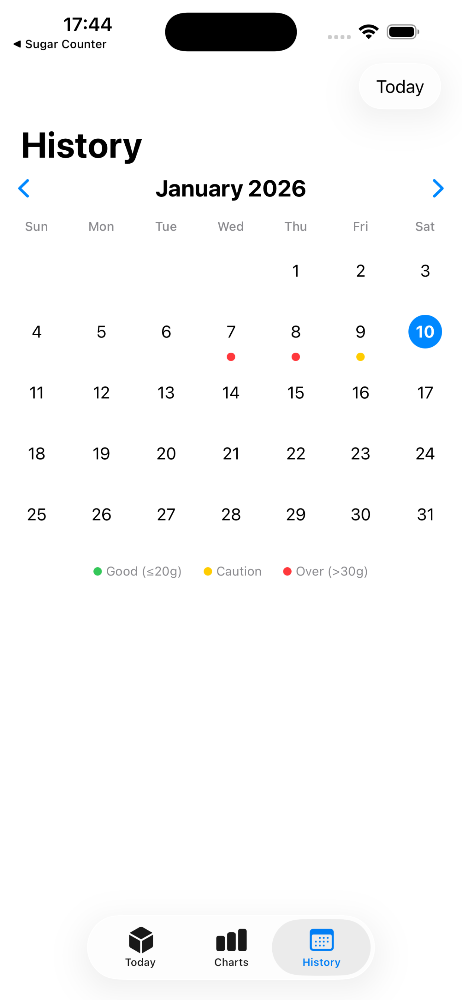
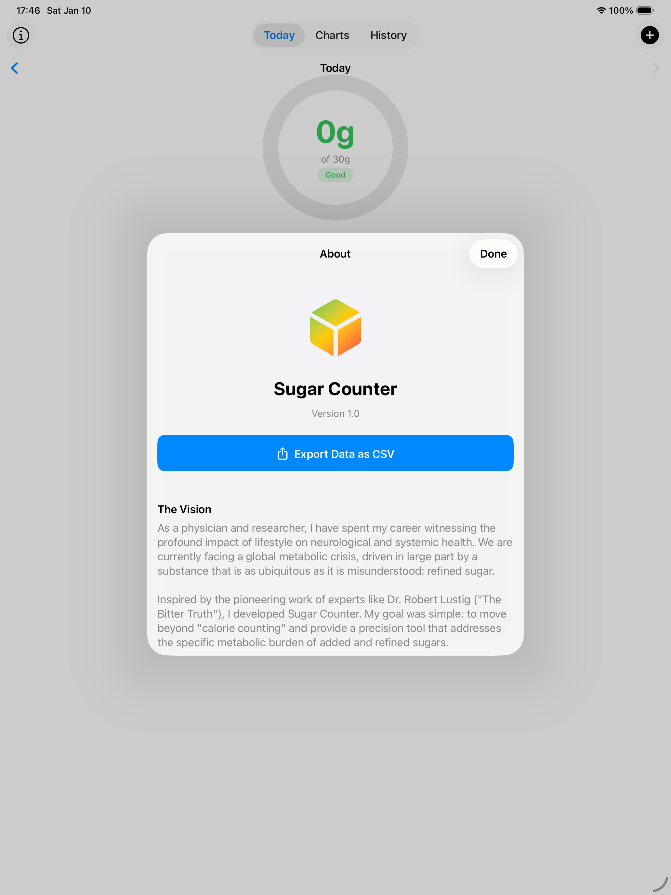

# Sugar Counter

A comprehensive iOS app for tracking daily refined sugar intake with educational content, personalized insights, and gamification features.

## Features

### Daily Tracking
- Simple numeric keypad entry for quick logging
- Visual progress ring with color-coded feedback (green/yellow/red)
- Customizable daily goals with WHO and AHA presets
- Navigate between days to add retrospective entries

### Insights & Gamification
- Track your current streak and longest streak
- View statistics: success rate, daily average, best day
- Unlock 9 achievements as you build healthy habits
- Pattern analysis comparing weekday vs weekend consumption

### Educational Content
- Learn why refined sugar matters for your health
- Browse 80+ common foods with their sugar content
- Discover hidden sugars in everyday foods
- Reference official WHO and AHA guidelines

### History & Charts
- Calendar view with color-coded daily status
- Bar charts for weekly/monthly trends
- Export all your data as CSV

## Screenshots

  
  
  

  

## TestFlight Beta

Sugar Counter is currently in TestFlight beta testing. If you'd like to try it out and provide feedback, please contact me:

- **Email**: [Open an issue](https://github.com/neuroccm/SugarCounter/issues) on this repository
- **Twitter/X**: [@neuroccm](https://twitter.com/neuroccm)

## About

Developed by **Dr. Houman Khosravani, MD PhD FRCPC**

As a physician and researcher, I developed Sugar Counter to provide a precision tool that addresses the specific metabolic burden of added and refined sugars. Inspired by the work of experts like Dr. Robert Lustig, this app moves beyond simple calorie counting to focus on what matters for metabolic health.

## Technical Details

- **Platform**: iOS 17.0+
- **Framework**: SwiftUI + SwiftData
- **Storage**: 100% local (no cloud sync)
- **Privacy**: No data collection, no analytics

## License

Copyright 2025 Houman Khosravani. All rights reserved.

## Disclaimer

This app is for educational and informational purposes only. It is not intended to be a substitute for professional medical advice, diagnosis, or treatment. Always seek the advice of your physician or another qualified health provider with any questions you may have regarding a medical condition.
